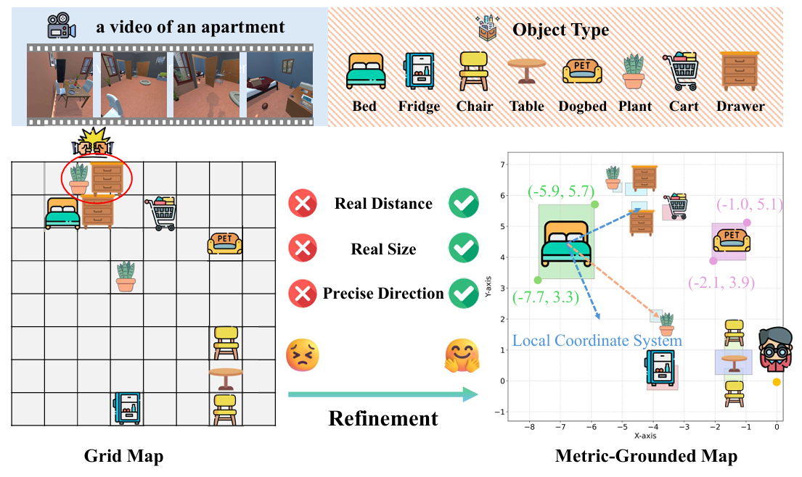

<div align="center">

# Video2Layout: Recall and Reconstruct Metric-Grounded Cognitive Map for Spatial Reasoning
[](https://arxiv.org/abs/2511.16160) [](https://huggingface.co/ybrrraway)

</div>

**Video2Layout** is a framework for reconstructing metric-grounded spatial layouts from video. It leverages continuous object boundary coordinates to quantify inter-object physical distances and object sizes, equipping the model with quantitative spatial computation capabilities. This effectively mitigates the inherent ambiguity in describing spatial relationships through natural language. Additionally, the framework adopts a two-stage SFT-to-RL training paradigm, which enhances the model's spatial reasoning abilities.

## 🚀 Overview


<p align="center">
  
</p>

🎯 **Key Benefits**:
- **Metric-Grounded Cognitive Map** — an accurate bird 's-eye view reflects the specific position of an object in the scene
- **Spatial reasoning computation** — rigorous mathematical calculations eliminate the fuzziness of traditional natural language COT description spatial relationship reasoning
- **Generalization of real scenes** — only the information of simulation data is needed, and there are no requirements for real scenarios.

<p align="center">
  
</p>

**QVS-Bench** is a diagnostic benchmark for systematically evaluating how the quantity of image inputs impacts spatial reasoning accuracy. It maintains a substantially uniform proportional distribution across five input scale configurations (1, 4, 8, 12, and 16 frames), ensuring fair and unbiased analysis of the relevant mechanisms. 

<p align="center">
  
</p>


## 🛠️ Usage
### (Step 1) Install
```bash
conda create -n v2lo python=3.10 -y 
conda activate v2lo
pip install -r requirements.txt
```

### (Step 2) Training
```bash
# SFT training
bash src/ms-swift/sft.sh
# Merge model
bash src/ms-swift/merge_lora.sh

# RL training
bash src/EasyR1/examples/rl.sh
# Merge model
cd src/EasyR1
python3 scripts/model_merger.py --local_dir checkpoints/easy_r1/exp_name/global_step_1/actor
```

## Citation
If you find our works useful for your research, please consider citing:
```bibtex
@misc{2511.16160,
Author = {Yibin Huang and Wang Xu and Wanyue Zhang and Helu Zhi and Jingjing Huang and Yangbin Xu and Yangang Sun and Conghui Zhu and Tiejun Zhao},
Title = {Video2Layout: Recall and Reconstruct Metric-Grounded Cognitive Map for Spatial Reasoning},
Year = {2025},
Eprint = {arXiv:2511.16160},
}
```

## Acknowledgement
* The training codes are built on [ms-swift](Video2Layout/src/EasyR1) and [EasyR1](https://github.com/hiyouga/EasyR1).
* The base models are from [Qwen2.5-VL-7B-Instruct](https://huggingface.co/Qwen/Qwen2.5-VL-7B-Instruct).